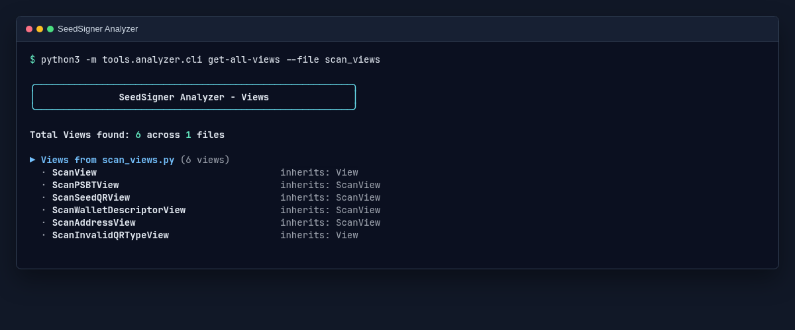
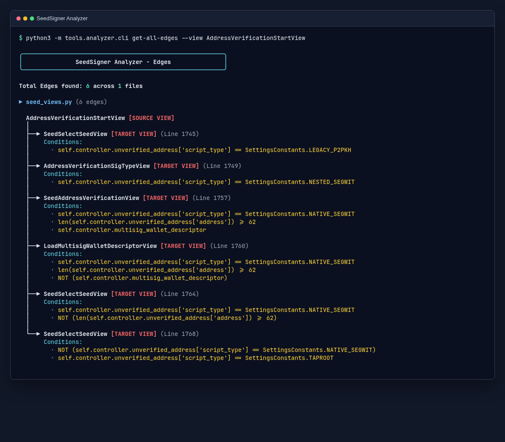
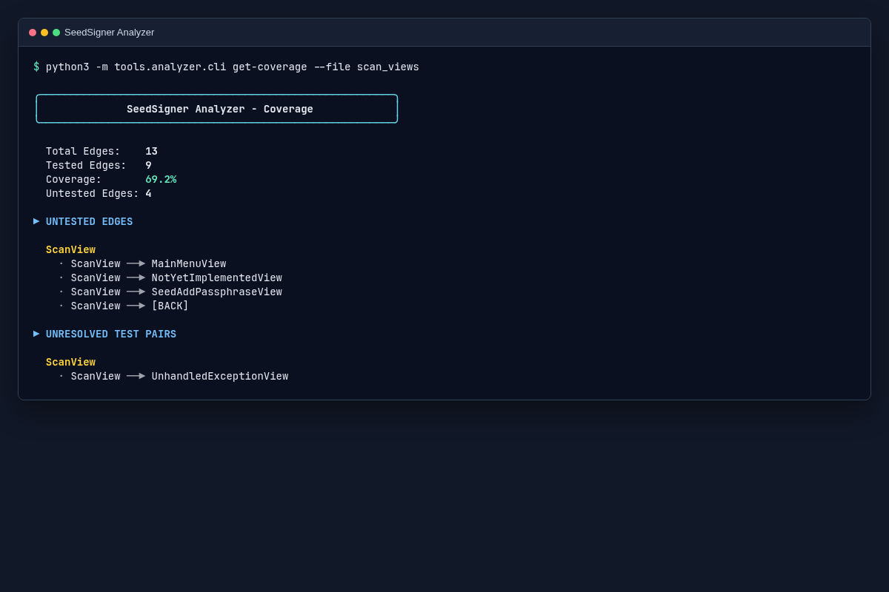
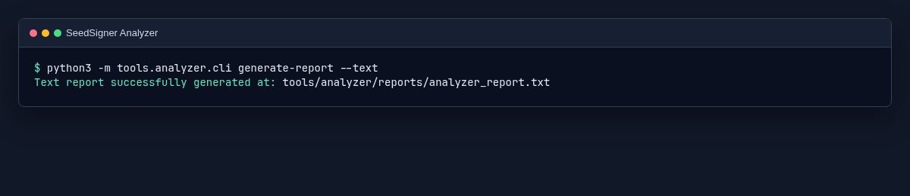

# SeedSigner Analyzer

The SeedSigner Analyzer is a static-analysis tool for the application's View navigation. It
parses Python source with the standard-library `ast` module instead of importing or running
the application.

It finds View classes, `Destination` calls between Views, and `FlowStep` sequences in
FlowTests. It then compares the routes defined in the source with the routes exercised by the
tests.

Use it to inspect the navigation graph, identify static navigation edges without FlowTest
coverage, inspect conditions on a route, and write the extracted data as text or JSON reports.

Because the tool reads source code rather than executing it, its output describes the routes
and test sequences it can statically identify. It does not replace FlowTests or prove a route
can be reached at runtime.

The analyzer uses only the Python standard library. It does not need the SeedSigner runtime,
hardware mocks, or a separate dependency install.

## Start here

The analyzer is on the `sob-2026` branch. Clone the repository and switch to that branch:

```bash
git clone https://github.com/PROWLERx15/seedsigner.git
cd seedsigner
git switch sob-2026
```

Use Python 3.10 or later. Run commands from the repository root:

```bash
python3 -m tools.analyzer.cli --help
```

Use `python3 -m tools.analyzer.cli`, not `python3 tools/analyzer/cli.py`. The module form is
required because the analyzer imports its sibling modules as a Python package.

## First commands

List every View in one module:

```bash
python3 -m tools.analyzer.cli get-all-views --file scan_views
```



Inspect the routes from one View:

```bash
python3 -m tools.analyzer.cli get-all-edges --view AddressVerificationStartView
```



Check FlowTest coverage for one module:

```bash
python3 -m tools.analyzer.cli get-coverage --file scan_views
```



Generate a full text report:

```bash
python3 -m tools.analyzer.cli generate-report --text
```



The command writes the report to `tools/analyzer/reports/analyzer_report.txt`.

## What the analyzer reads

The analyzer locates the repository root from its own path. It reads:

- `src/seedsigner/views/*.py` for View classes and navigation destinations.
- `tests/test_flows*.py` for FlowTest sequences.
- `tests/base.py` to check the `FlowStep` and `run_sequence()` shapes used by the extractor.

It records the source View, target View, source file, line number, branch condition, and
`Destination` metadata such as `skip_current_view` and `clear_history`.

## Command reference

All commands use this form:

```bash
python3 -m tools.analyzer.cli <command> [options]
```

Use `--help` to show the command list. Every subcommand also accepts `-h` or `--help`.

```bash
python3 -m tools.analyzer.cli --help
python3 -m tools.analyzer.cli get-coverage --help
```

### `get-all-views`

Prints the View classes found in `src/seedsigner/views/`. The output groups Views by source
file and lists their base classes.

```bash
python3 -m tools.analyzer.cli get-all-views
python3 -m tools.analyzer.cli get-all-views --file scan_views
python3 -m tools.analyzer.cli get-all-views --file scan_views.py
```

Options:

- `--file FILE`: limit output to one view module. The `.py` suffix is optional.

### `get-all-edges`

Prints navigation destinations found in the View source. Each edge includes the target View,
source line, and the enclosing conditions that lead to that destination.

```bash
python3 -m tools.analyzer.cli get-all-edges
python3 -m tools.analyzer.cli get-all-edges --file seed_views
python3 -m tools.analyzer.cli get-all-edges --view AddressVerificationStartView
python3 -m tools.analyzer.cli get-all-edges --file scan_views --view ScanView
```

Options:

- `--file FILE`: limit output to one view module. The `.py` suffix is optional.
- `--view VIEW_NAME`: limit output to one View. The value must be the exact class name and
  must end in `View`.

`[BACK]` in the output means the View returns `Destination(BackStackView)`. The controller
decides the restored View from its runtime back stack.

### `generate-report`

Writes a full report after extracting Views, edges, and FlowTest coverage.

```bash
python3 -m tools.analyzer.cli generate-report --text
python3 -m tools.analyzer.cli generate-report --json
```

Options:

- `--text`: write `tools/analyzer/reports/analyzer_report.txt`.
- `--json`: write `tools/analyzer/reports/analyzer_report.json`.

Pass one output option at a time. If both options are supplied, the command generates the JSON
report because it checks `--json` first.

The generated files are snapshots of the repository at the time the command runs. Run the
command again after changing a View or FlowTest.

### `get-coverage`

Prints how many static navigation edges are covered by the extracted FlowTest sequences. It
also lists untested edges and test pairs that could not be resolved to a known static edge.

```bash
python3 -m tools.analyzer.cli get-coverage
python3 -m tools.analyzer.cli get-coverage --file scan_views
python3 -m tools.analyzer.cli get-coverage --view ScanView
python3 -m tools.analyzer.cli get-coverage --file seed_views --view SeedOptionsView
```

Options:

- `--file FILE`: limit the coverage result to transitions whose source View is in one module.
  The `.py` suffix is optional.
- `--view VIEW_NAME`: limit the result to transitions from one View. The value must be the
  exact class name and must end in `View`.
- `--include-negative-assertions`: include sequences inside `pytest.raises(...)` blocks.
  Those sequences are excluded by default because they assert an expected failure rather than
  a successful navigation path.

Filtering applies to the source View. For example, `--file scan_views` includes edges that
start in `ScanView` or another View defined in `scan_views.py`, even when the target View is
defined in another module.

## Common errors

`The --view argument must end with 'View'`

Use the full class name, such as `ScanView` or `AddressVerificationStartView`.

`File '...' not found in the views directory`

Pass a filename from `src/seedsigner/views/`, with or without the `.py` suffix.

`You must specify --json or --text when generating a report`

Choose an output format for `generate-report`.

`Could not locate the SeedSigner repository root`

Run the command from a checkout that contains `src/seedsigner/controller.py`. The setup steps
above create the expected layout.
